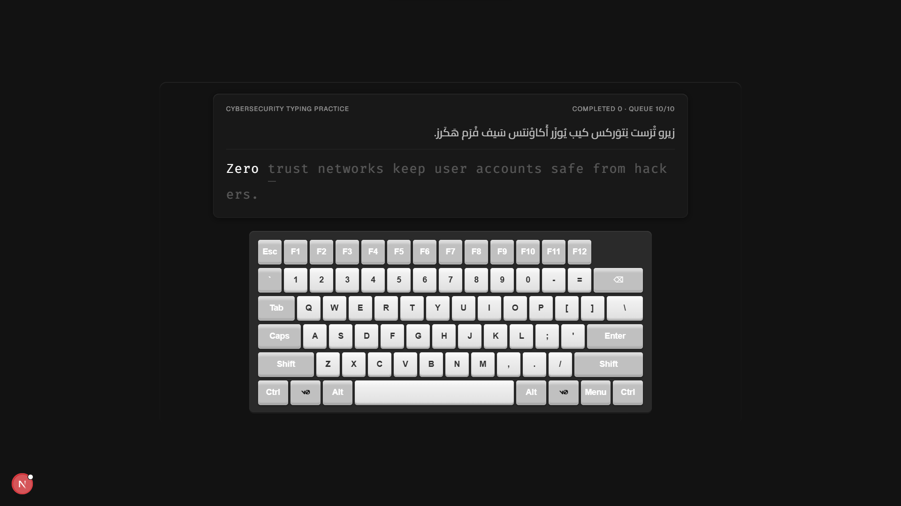

# ⌨️ Mechanical Keyboard — Cybersecurity Typing Practice

<div align="center">



[](https://nextjs.org/)
[](https://www.typescriptlang.org/)
[](https://www.framer.com/)
[](LICENSE)

**لوحة مفاتيح ميكانيكية واقعية مع نظام تدريب على الكتابة بمحتوى الأمن السيبراني**

</div>

---

## ✨ الميزات الرئيسية

### 🎹 صوت ميكانيكي واقعي
- **طبقة الـ "Click"**: نبضة ضوضاء مُصفّاة (Bandpass Noise Burst) تُعطي الصوت الميكانيكي المميز
- **طبقة الـ "Thock"**: نغمة جسدية منخفضة (Sine Body Tone) تُحاكي ثقل الكابات الحقيقية
- تنوع طفيف عشوائي في الصوت لكل ضغطة — لا ضغطتان متطابقتان

### ⚡ أداء فائق بدون تأخير
- **AudioContext Warm-up**: تسخين مسبق عند أول تفاعل للمستخدم لإزالة أي تأخير صوتي
- **بدون Blocking**: لا يوجد أي قفل على الإدخال بين الجمل — الكاتب السريع لا يفقد أي ضغطة
- **CSS Fade-in**: الانتقال بين الجمل يعتمد على CSS Animation بدون إعاقة الـ input

### 📚 تدريب ذكي على الكتابة
- **10 جمل دفعة واحدة**: يجلب 10 جمل مسبقاً من AI (GLM) لضمان تجربة سلسة
- **قائمة انتظار ذكية**: تُملأ في الخلفية تلقائياً دون انتظار المستخدم
- **Fallback محلي**: 10 جمل احتياطية تضمن العمل حتى بدون إنترنت
- **بدون تكرار**: نظام تتبع شامل يمنع ظهور نفس الجملة مرتين

### 🔐 محتوى الأمن السيبراني
- جمل تدريبية متخصصة في مجال الأمن السيبراني (Cybersecurity)
- **ترجمة صوتية عربية**: كل جملة إنجليزية مرفقة بنطقها بالعربية
- تغطي مواضيع: MFA، Phishing، Encryption، Firewalls، Zero Trust، Ransomware، وغيرها

### 🎨 واجهة بصرية متقدمة
- **3 أوضاع للوحة**: Regular (كاملة) · Apple (Butterfly) · Mobile (هاتف)
- **مؤشر الكتابة**: لون أبيض قوي للحروف الصحيحة · أحمر للأخطاء · رمادي للمنتظر
- **كيرسر متحرك**: خط تحتي يتبع الكتابة بدون إعادة تخطيط الصفحة
- **عداد التقدم**: يعرض عدد الجمل المكتملة وحجم قائمة الانتظار

---

## 🖼️ لقطة شاشة

<div align="center">


</div>

---

## 🚀 التشغيل

```bash
# تثبيت الحزم
pnpm install

# تشغيل للتطوير
pnpm dev

# بناء للإنتاج
pnpm build
```

افتح [http://localhost:3000](http://localhost:3000) في المتصفح.

---

## 🛠️ التقنيات المستخدمة

| التقنية | الاستخدام |
|--------|-----------|
| **Next.js 16** | إطار العمل الأساسي |
| **TypeScript** | الأمان النوعي |
| **Web Audio API** | توليد صوت الضغط الميكانيكي |
| **Framer** | Property Controls للتخصيص |
| **React Hooks** | إدارة الحالة والأداء |

---

## ⚙️ خيارات التخصيص (Framer)

| الخاصية | الوصف |
|---------|-------|
| `keyboardVariant` | نوع اللوحة: Regular / Apple / Mobile |
| `keyboardColor` | لون جسم اللوحة |
| `specialKeyboardColor` | لون مفاتيح الوظائف |
| `textColor` | لون النص |
| `backgroundColor` | لون الخلفية |
| `transparentBackground` | خلفية شفافة |
| `keyFont` | خط أزرار اللوحة |
| `keyRemappings` | إعادة تعيين المفاتيح |
| `customKeycapImages` | صور مخصصة للأزرار |
| `specialKeyLink` | رابط مفتاح Windows/Apple |

---

## 📁 هيكل المشروع

```
keyboard-component/
├── app/
│   ├── page.tsx              # الصفحة الرئيسية
│   ├── layout.tsx            # التخطيط العام
│   └── api/
│       └── generate-sentence/ # API توليد الجمل بـ GLM
├── components/
│   └── mechanical-keyboard.tsx  # المكوّن الرئيسي
├── public/
│   └── screenshot.png        # لقطة شاشة
└── README.md
```

---

<div align="center">

صُنع بـ ❤️ للمهتمين بالأمن السيبراني وتحسين مهارة الكتابة

</div>
